# EIRS Production Architecture Specification
## Equipment Identity Register System (EIRS) — Enterprise Cloud Architecture

---

### Executive Summary

This architecture defines a fault-tolerant, highly available, secure, and compliant cloud deployment for the **Equipment Identity Register System (EIRS)** on Amazon Web Services (AWS). It adheres to the **AWS Well-Architected Framework** across the six pillars: Operational Excellence, Security, Reliability, Performance Efficiency, Cost Optimization, and Sustainability.

The system is separated into **7 distinct architectural layers**, backed by an automated **DevOps & QA deployment control plane** driven by **Antigravity AI Agent + AWS CLI + Infrastructure as Code (IaC)**.

---

### 1. The 7-Layer Architecture Overview

```mermaid
flowchart TB
    subgraph L1["Layer 1: User & Presentation Layer"]
        WebAdmin["Administrative Web Portal (React / S3)"]
        ConsumerApp["Public Portal & Mobile Clients"]
        TelecomPartners["Telecom Operator Core Gateways"]
    end

    subgraph L2["Layer 2: Edge & Perimeter Security"]
        Route53["Amazon Route 53 (Latency & Geo DNS)"]
        CloudFront["Amazon CloudFront (Edge CDN / TLS 1.3)"]
        WAF["AWS WAF (Rate Limiting, IP Reputation, OWASP Top 10)"]
        Shield["AWS Shield Standard (DDoS Protection)"]
    end

    subgraph L3["Layer 3: API & Compute Layer"]
        APIGW["Amazon API Gateway (REST API / Throttling / Mutual TLS)"]
        Cognito["Amazon Cognito (User Pools / JWT Authorizer)"]
        LambdaVerify["Lambda: Device Verification Service"]
        LambdaRegister["Lambda: Device Registration Service"]
        LambdaAdmin["Lambda / ECS: Admin & Audit Service"]
    end

    subgraph L4["Layer 4: Data & Integration Layer"]
        DynamoDB["Amazon DynamoDB (Global Tables / In-Memory DAX)"]
        S3DataLake["Amazon S3 (Encrypted Audit Logs & CDRs)"]
        SQSIngestion["Amazon SQS (Decoupled Device Ingestion Queue)"]
        SNSAlerts["Amazon SNS (Operator Event Broadcasting)"]
    end

    subgraph L5["Layer 5: Infrastructure & Network Security"]
        VPC["AWS VPC (Multi-AZ Public, Private & Data Subnets)"]
        VPCEndpoints["AWS PrivateLink / VPC Endpoints (S3, DynamoDB, Secrets)"]
        KMS["AWS KMS (Customer Managed Keys - Envelope Encryption)"]
        SecretsMgr["AWS Secrets Manager & SSM Parameter Store"]
        IAM["IAM Least-Privilege Roles & Permission Boundaries"]
    end

    subgraph L6["Layer 6: DevOps, Control Plane & QA"]
        GitRepo["Git Repository (Monorepo / Version Control)"]
        Antigravity["Antigravity AI Development Agent"]
        AWSCLIControl["AWS CLI & IaC Deployment Control Plane"]
        CICDPipeline["CI/CD Pipeline (GitHub Actions / Multi-Environment)"]
        QASuite["Automated QA Suite (Unit, Contract, DAST, Perf)"]
    end

    subgraph L7["Layer 7: Observability & Operational Resilience"]
        CWLogs["CloudWatch Logs & Insights"]
        CWMetrics["CloudWatch Metrics & Alarms"]
        XRay["AWS X-Ray (End-to-End Distributed Tracing)"]
        SyntheticCanary["CloudWatch Synthetics (Continuous Health Canary)"]
    end

    ConsumerApp & WebAdmin & TelecomPartners --> Route53
    Route53 --> CloudFront
    CloudFront --> WAF
    WAF --> Shield
    CloudFront --> WebAdmin
    CloudFront --> APIGW
    APIGW --> Cognito
    APIGW --> LambdaVerify & LambdaRegister & LambdaAdmin

    LambdaVerify & LambdaRegister --> DynamoDB
    LambdaRegister --> SQSIngestion
    SQSIngestion --> S3DataLake
    LambdaAdmin --> SNSAlerts

    LambdaVerify & LambdaRegister -.-> VPCEndpoints
    VPCEndpoints -.-> VPC
    LambdaVerify -.-> KMS
    LambdaVerify -.-> SecretsMgr
    LambdaVerify -.-> IAM

    GitRepo --> CICDPipeline
    Antigravity --> AWSCLIControl
    CICDPipeline --> AWSCLIControl
    AWSCLIControl --> VPC & APIGW & DynamoDB & CloudFront
    QASuite --> APIGW

    LambdaVerify & APIGW & DynamoDB --> CWLogs & CWMetrics & XRay
    SyntheticCanary --> CloudFront
```

---

### 2. Detailed Layer Specifications

#### Layer 1: User & Presentation Layer
* **Public Device Verification Portal**: Static single-page application (SPA) allowing end users to check IMEI status (Stolen, Blocked, Valid, Pending Duties).
* **Enterprise Admin Dashboard**: Role-Based Access Control (RBAC) portal for telecommunications authority administrators and customs officials.
* **Carrier Gateway Ingestion**: Dedicated programmatic API interface for MNOs (Mobile Network Operators) to sync Equipment Identity Registers.

#### Layer 2: Edge & Perimeter Security
* **Amazon Route 53**: Geo-proximity routing with active-active health checking across primary and disaster recovery regions.
* **Amazon CloudFront**: Distributed global edge network caching static assets, terminating TLS 1.3, and minimizing latency.
* **AWS WAF (Web Application Firewall)**:
  * OWASP Top 10 mitigation rules (SQLi, XSS, SSRF).
  * Rate-based limiting: Maximum 1,000 requests per 5 minutes per IP on public query routes to prevent brute-force IMEI scrapers.
  * Geo-blocking rules preventing unauthorized cross-border administrative access.
* **AWS Shield**: Continuous Layer 3/4 DDoS protection.

#### Layer 3: API & Compute Layer
* **Amazon API Gateway**:
  * Edge-optimized REST APIs with integrated request validation against OpenAPI 3.0 schemas.
  * JWT verification integrated with **Amazon Cognito** user pools and custom OAuth2 machine-to-machine tokens.
  * Usage plans, API keys, and tiered throttling.
* **AWS Lambda & Serverless Compute**:
  * Microservices implemented in Node.js / Python running inside dedicated VPC private subnets.
  * **VerifyHandler**: Low-latency sub-50ms IMEI verification cache lookup.
  * **RegisterHandler**: ACID-compliant device registration flow with deduplication.
  * **StatusHandler**: Operational health check endpoint for canaries and load balancers.

#### Layer 4: Data & Integration Layer
* **Amazon DynamoDB**:
  * Single-digit millisecond latency at any scale.
  * Partition Key (`PK`): `DEVICE#<IMEI>`, Sort Key (`SK`): `METADATA`.
  * Global Secondary Indexes (GSIs) for `MSISDN`, `IMSI`, and `Status`.
  * Point-in-Time Recovery (PITR) enabled; DynamoDB Streams enabled for asynchronous audit logging.
* **Amazon S3**:
  * Immutable write-once-read-many (WORM) storage for audit logs with Object Lock and S3 Intelligent-Tiering.
* **Amazon SQS & EventBridge**:
  * Dead-letter queues (DLQ) configured for guaranteed message processing and retries.

#### Layer 5: Infrastructure & Network Security
* **Virtual Private Cloud (VPC)**:
  * 3 Availability Zones (AZs) for high availability.
  * Isolated subnets: Public (NAT/ALB), Private (Compute), and Data (Database/Endpoints).
  * No public IP addresses assigned to database or compute resources.
* **AWS PrivateLink / VPC Endpoints**:
  * Gateway Endpoints for Amazon S3 and DynamoDB (free, zero-NAT traffic costs).
  * Interface Endpoints for Secrets Manager, CloudWatch, and KMS.
* **AWS KMS**:
  * Customer Managed Keys (CMKs) with annual key rotation.
  * Envelope encryption for all data at rest across DynamoDB, S3, and CloudWatch.

#### Layer 6: DevOps, Control Plane & QA
* **Antigravity AI Agent + AWS CLI**:
  * The deployment control plane is powered by modular, scriptable AWS CLI tooling rather than manual AWS Console actions.
  * Automated pre-flight validation, resource provisioning, state synchronization, and post-deployment validation.
* **CI/CD Pipeline (GitHub Actions)**:
  * Automated lifecycle: Commit ➔ Lint ➔ SAST (Trivy/Semgrep) ➔ Dev Deploy ➔ Smoke Test ➔ QA Deploy ➔ Automated API & Integration Tests ➔ Staging Deploy ➔ Manual Release Gate ➔ Production Canary Deployment.

#### Layer 7: Observability & Operational Resilience
* **Amazon CloudWatch**:
  * Centralized structured JSON log groups with 30-day retention policies in Dev/QA and 365-day compliance retention in Prod.
  * High-resolution metrics for API latency (p95, p99), 4xx/5xx error rates, Lambda throttles, and DynamoDB consumed capacity.
* **AWS X-Ray**:
  * Distributed trace IDs passed from CloudFront ➔ API Gateway ➔ Lambda ➔ DynamoDB for end-to-end debugging.
* **CloudWatch Synthetics**:
  * 24/7 automated canary running synthetic transactions against `/api/v1/status` every 60 seconds with PagerDuty / SNS alarming.
