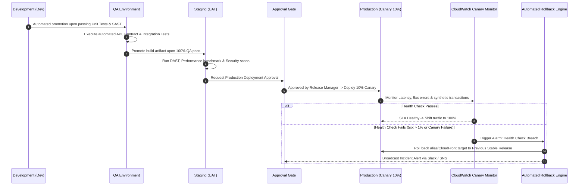

# EIRS Operations & Incident Response Runbook
## Runbooks, Monitoring Thresholds, and Automated Recovery Procedures

---

### 1. Key Operational Metrics & Alarm Thresholds

| Metric Name | AWS Namespace | Warning Threshold | Critical Threshold | Automated Action |
| :--- | :--- | :--- | :--- | :--- |
| **API 5XX Error Rate** | `AWS/ApiGateway` | > 1.0% over 5 mins | > 3.0% over 2 mins | Trigger SNS PagerDuty, halt active deployments |
| **API Latency (p95)** | `AWS/ApiGateway` | > 300 ms | > 800 ms | Scale Lambda concurrency, alert on-call engineer |
| **Lambda Throttles** | `AWS/Lambda` | > 5 throttles / min | > 20 throttles / min | Auto-increase reserved concurrency limits |
| **DynamoDB Read/Write Throttles** | `AWS/DynamoDB` | > 0 throttles | > 10 throttles | Escalate DynamoDB autoscaling capacity |
| **Synthetics Canary Failure** | `CloudWatchSynthetics` | 1 probe failed | 2 consecutive failures | **Initiate Automatic Rollback Script** |

---

### 2. Multi-Environment Promotion & Rollback Workflow



---

### 3. Emergency Incident Runbooks

#### Runbook A: Immediate Production Rollback
If a defect escapes to production or error rates spike, execute the instant rollback script:
```powershell
# From deployment control plane:
pwsh ./scripts/aws-cli/08-rollback.ps1 -Environment "prod" -TargetVersion "PREVIOUS_STABLE"
```
**What this does:**
1. Instantly shifts API Gateway stage variable / Lambda alias routing weight 100% back to previous stable version.
2. Invalidates CloudFront edge caches.
3. Posts operational resolution logs to CloudWatch and alerts the response team.

#### Runbook B: WAF Rate-Limiting Adjustment (Handling Traffic Surge)
In the event of a legitimate national registration spike or holiday surge:
```powershell
aws wafv2 update-rule-group --scope REGIONAL --name EIRS-RateLimit-Rule ...
```
Detailed commands are encapsulated in `./scripts/aws-cli/06-deploy-edge.ps1`.
