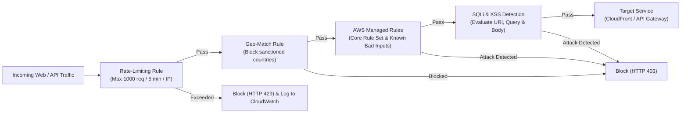

# EIRS Threat Model & Security Architecture
## STRIDE Analysis, Defense-in-Depth, and Compliance Controls

---

### 1. Threat Modeling Overview (STRIDE)

| Threat Category | Potential Vector in EIRS | Mitigation Control | AWS Implementation |
| :--- | :--- | :--- | :--- |
| **Spoofing** | Forged carrier API requests or fake client identity | Mutual TLS (mTLS), Cognito JWT validation, IAM SigV4 | API Gateway Client Certs + Cognito User Pools |
| **Tampering** | Modification of IMEI status or device records in transit/at rest | End-to-end TLS 1.3, KMS envelope encryption, DynamoDB PITR | AWS KMS CMK + DynamoDB Streams + S3 Object Lock |
| **Repudiation** | Operator denying IMEI blacklisting request | Immutable audit trails, digitally signed transaction logs | CloudTrail + CloudWatch Logs + S3 WORM Storage |
| **Information Disclosure** | Scraping of subscriber IMSI/MSISDN linked with IMEI | Attribute-level masking, VPC PrivateLink, IAM least-privilege | Field-level encryption + VPC Private Subnets |
| **Denial of Service** | DDoS attack flooding public IMEI verification endpoint | Edge rate limiting, Geo-restriction, DDoS shielding | AWS WAF + AWS Shield Standard + API Gateway Throttling |
| **Elevation of Privilege** | Compromised contractor gaining administrator DB access | Zero-trust RBAC, IAM permission boundaries, Break-glass MFA | IAM Roles + AWS Secrets Manager + AWS Systems Manager |

---

### 2. Perimeter Security & AWS WAF Configuration

The Web Application Firewall (WAFv2) is deployed directly in front of Amazon CloudFront and the API Gateway.

---

### 3. Encryption Standard (At Rest & In Transit)

1. **In-Transit**:
   - TLS 1.3 enforced on CloudFront and API Gateway. Legacy protocols (SSLv3, TLS 1.0, TLS 1.1) disabled.
   - Internal microservice-to-AWS service communication uses AWS PrivateLink across private VPC interfaces.
2. **At-Rest**:
   - Customer-Managed KMS Keys (CMKs) configured with automatic 365-day rotation.
   - All DynamoDB tables configured with `AWS_KMS` encryption.
   - S3 buckets enforce `aws:kms` server-side encryption and deny unencrypted PUT requests via bucket policies.

---

### 4. Zero-Trust Network & IAM Architecture

- **No Publicly Accessible Databases or Compute**: Compute runtimes reside in private subnets without public IPv4 addresses. Egress to internet is restricted via managed NAT Gateways with strict security group egress rules.
- **IAM Permission Boundaries**: Developers and CI/CD agents operate under strict IAM permission boundaries that prohibit creating unrestricted IAM policies or disabling logging.
